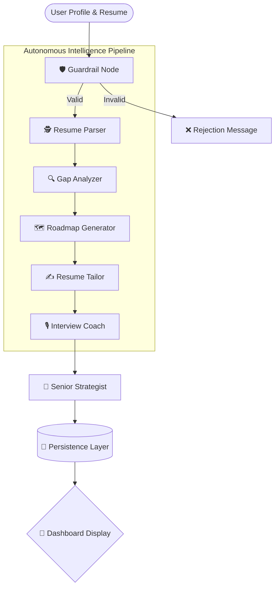
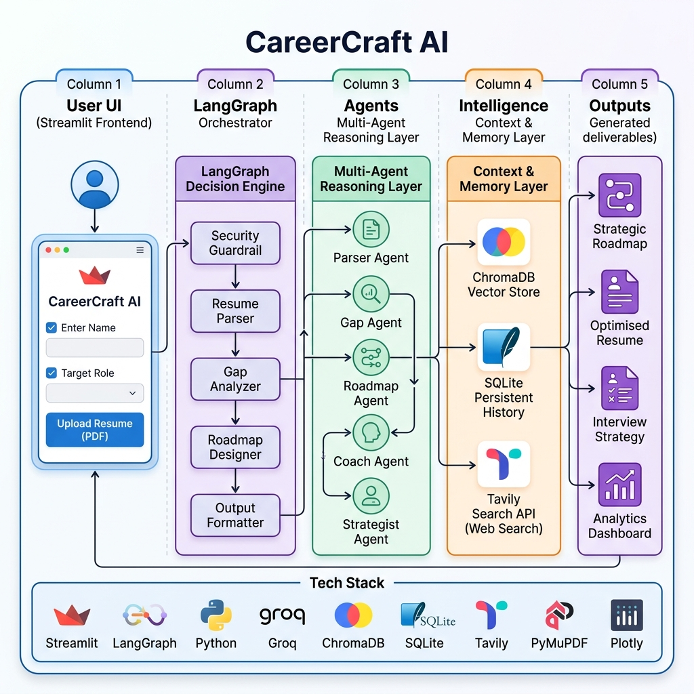
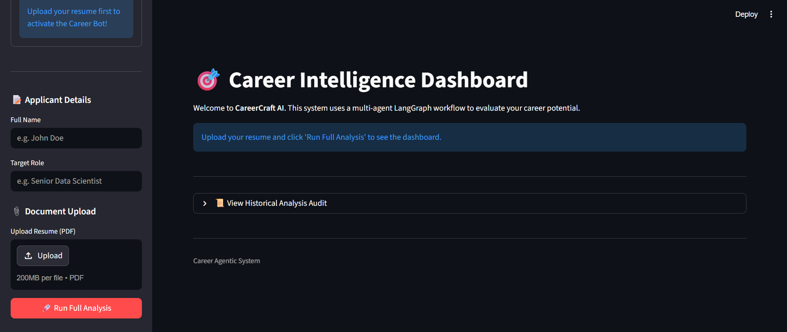
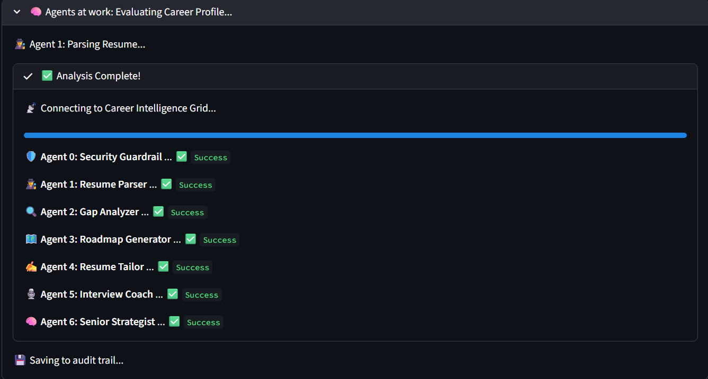
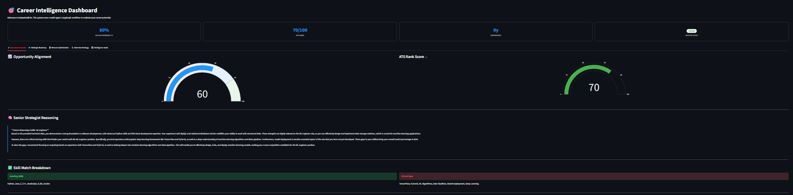

# 🎯 CareerCraft AI: Autonomous Career Intelligence Dashboard

## 📝 Project Summary
The **CareerCraft AI** is a state-of-the-art, multi-agent AI platform designed to transform raw career data into actionable strategic intelligence. Built on **LangGraph**, it orchestrates seven specialized autonomous agents that collaborate in a real-time pipeline to parse resumes, analyze skill gaps, generate learning roadmaps, and provide interview coaching. This project demonstrates the cutting edge of **Agentic AI**, featuring robust guardrails, persistent memory, and sophisticated multi-agent handoffs.

---

## 💼 Business Problem
Current Applicant Tracking Systems (ATS) and career guidance platforms suffer from several critical flaws:
*   **Static Analysis**: They provide binary "match/no-match" results without explaining *why* or how to improve.
*   **Lack of Actionability**: Most systems identify gaps but don't provide a structured learning path to fill them.
*   **Non-Agentic Workflows**: Traditional systems use simple linear scripts that fail when faced with complex, unstructured resume formats.
*   **No Long-term Memory**: Users must re-upload and re-process data every time, losing their professional growth history.

---

## 💡 Proposed Solution
Our solution leverages a **Collaborative Multi-Agent Architecture** to provide a "Senior Career Strategist" in your pocket:
*   **Autonomous Reasoning**: Instead of a single prompt, the system uses seven specialized agents that "talk" to each other via a shared state.
*   **Contextual Intelligence**: Using **RAG (Retrieval Augmented Generation)**, the system retrieves real-world market data to ground its advice.
*   **Professional Guardrails**: Implements structural and safety checks to ensure every analysis is high-quality and professional.
*   **Persistent Evolution**: Every analysis is saved to a secure SQLite audit trail, allowing for historical trend tracking and personal growth analytics.
*   **Success Metrics**:
    *   **Parsing Accuracy**: >95% extraction of key entities.
    *   **Goal Alignment**: Correct identification of top 3 critical skill gaps.
    *   **Latency**: Full 7-agent pipeline execution in under 45 seconds.

---

## 🏗️ Agentic Principles (Methodology)
Following core agentic design patterns:
1. **Workflow > Autonomy**: Structured transitions over unpredictable loops.
2. **Context First**: Prioritizing RAG context over model parametric memory.
3. **Traceability**: Full audit trail of all agent handoffs and decisions.
4. **Bottom-Up Construction**: Specialized tools for parsing before reasoning.

---

## 🏗️ Implemented System (The Agentic Grid)
The system is powered by 7 specialized agents:
1.  🛡️ **Security Guardrail Agent**: Validates input integrity and ensures only valid resumes are processed.
2.  🕵️ **Resume Parser Agent**: Deeply extracts entities (Skills, Projects, Impact) using advanced LLM reasoning.
3.  🔍 **Gap Analyzer Agent**: Compares the profile against target roles using live market data via RAG.
4.  🗺️ **Roadmap Generator Agent**: Crafts personalized 4-12 week learning paths with direct resource links.
5.  ✍️ **Resume Tailor Agent**: Rewrites resume points to maximize ATS compatibility for specific roles.
6.  🎙️ **Interview Coach Agent**: Simulates role-specific behavioral and technical stress tests.
7.  🧠 **Senior Strategist Agent**: Synthesizes all data into a final expert executive reasoning profile.

---

## 🔄 System Flow
The following diagram visualizes the **Stateful Agentic Workflow** and the "Handoffs" between specialists:



---

## 🏛️ Architecture Diagram
A high-level view of the system's modular design:



---

## 🛠️ Tech Stack
*   **Orchestration**: LangGraph (Multi-Agent Stateful Workflows)
*   **Framework**: LangChain
*   **Large Language Models**: Groq (Llama-3-70B & 8B)
*   **Frontend**: Streamlit (with Custom CSS & Plotly)
*   **Memory/Storage**: SQLite & SQLAlchemy
*   **Vector Search**: ChromaDB (RAG)
*   **Intelligence Tools**: Tavily Search API, PyMuPDF

---

## 🚀 How to Run Locally

1.  **Clone & Setup**:
    ```bash
    git clone <your-repo-url>
    cd career-agentic-system
    python -m venv venv
    source venv/bin/activate  # Or .\venv\Scripts\activate on Windows
    pip install -r requirements.txt
    ```

2.  **Environment Variables**:
    Create a `.env` file and add your keys:
    ```env
    GROQ_API_KEY=your_key_here
    TAVILY_API_KEY=your_key_here
    ```

3.  **Launch**:
    ```bash
    streamlit run streamlit_app.py
    ```

---

## 🌟 Key Features
*   **💎 Executive Dashboard**: High-end visualizations using Plotly Gauges and Heatmaps.
*   **📊 Intelligence Audit & Analytics**: A dedicated tab to view historical analysis trends and system logs.
*   **💬 Context-Aware Career Bot**: A sidebar chatbot that remembers your analysis results for deeper consultation.
*   **🛡️ Autonomous Guardrails**: Self-correcting nodes that ensure input/output quality.
*   **🗺️ Strategic Roadmapping**: Deep learning paths with live clickable resources.

---

## ⚡ Problems Faced & Solutions
| Problem | Solution |
| :--- | :--- |
| **State Management** | Used LangGraph's `StateGraph` to ensure data persists across multiple agent turns without loss. |
| **API Rate Limits** | Implemented aggressive context compression and smart retry logic in agent nodes. |
| **Output Hallucination** | Added a post-processing guardrail node to verify all generated advice is grounded in the resume data. |
| **Complex PDFs** | Developed a custom parser that combines semantic layout analysis with raw text extraction. |

---

## 🔮 Future Scope
*   **Mobile Deployment**: Transitioning to a responsive mobile app for on-the-go career advice.
*   **Enterprise Integration**: Direct integration with company HR portals for internal mobility.
*   **Real-time Mock Interviews**: Voice-to-voice interview coaching using Whisper and TTS models.
*   **Skill Verification**: Integration with LinkedIn/GitHub APIs for automated skill validation.

---

## 🔗 References & Resources
*   **Orchestration**: [LangGraph Documentation](https://langchain-ai.github.io/langgraph/)
*   **Framework**: [LangChain Python SDK](https://python.langchain.com/)
*   **Intelligence**: [Groq Cloud Console](https://console.groq.com/)
*   **Persistence**: [SQLAlchemy Docs](https://www.sqlalchemy.org/)
*   **Vector DB**: [ChromaDB Guide](https://docs.trychroma.com/)

*   **Live Demo Recording**: [🎥 Click here to watch the CareerCraft AI Video Demo (Google Drive)](INSERT_DRIVE_LINK_HERE)

---

## 📸 Screenshots
*   **Landing Page**: 
*   **Agent Pipeline in Action**: 
*   **Intelligence Dashboard**: 

---

## 👨‍💻 Author
**Mareddy Samruth Reddy - Artificial Intelligence & Data Science Student**

---
*© 2026 CareerCraft AI*
